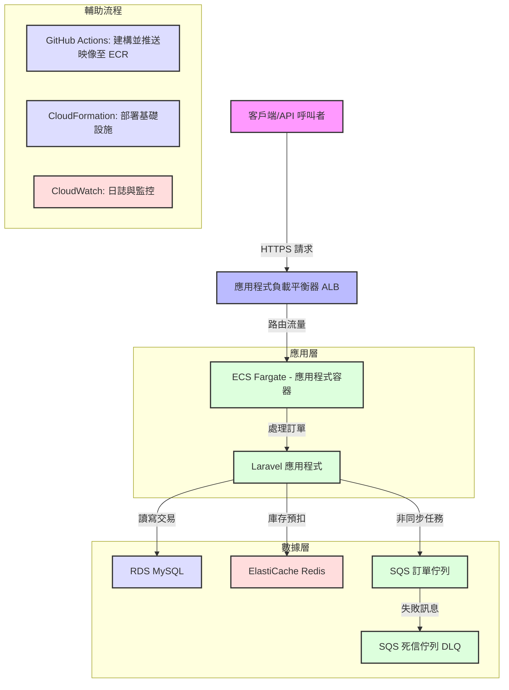

# HighConcurrencyECommerceAPI

## 專案概述
**HighConcurrencyECommerceAPI** 是一個基於 **Laravel 10.x**（PHP 8.2）的高併發電子商務 API 系統，專為處理高流量訂單交易設計，具備強大的防超賣機制，並深度整合 **AWS 雲端服務**（RDS、ElastiCache、SQS）。此專案展示後端開發、系統架構設計和雲端部署的專業能力，適合用於技術能力展示或電商平台核心功能實現。

在電商場景中，秒殺或促銷等高併發情境對庫存管理和響應速度有極高要求。本專案提供一個可擴展、高效能的 API 解決方案，模擬電商平台的訂單處理流程，採用現代 PHP 實踐與雲端原生技術。

- **目標**: 實現實時庫存控制與非同步訂單處理，確保高併發下的數據一致性。
- **關鍵特點**: Redis 原子性庫存管理、SQS 非同步處理、AWS CI/CD 整合。

## 技術架構
本專案採用分層、鬆耦合的架構設計，針對高併發與容錯進行優化，與 AWS 服務深度整合。

### 系統組成
- **客戶端層**: 透過 **應用程式負載平衡器 (ALB)** 路由請求，提供負載均衡與 HTTPS 安全終止。
- **應用層**: 部署於 **AWS ECS Fargate** 的 Laravel 應用程式，包含 NGINX、PHP-FPM 和 Supervisor，處理訂單邏輯與非同步任務。
- **數據層**:
  - **RDS MySQL**: 持久化儲存訂單與商品數據。
  - **ElastiCache Redis**: 實時庫存檢查與快取。
  - **Amazon SQS**: 非同步處理訂單，配有死信佇列 (DLQ) 處理失敗訊息。
- **CI/CD 管道**: 使用 **GitHub Actions** 建構 Docker 映像並推送至 ECR，透過 **CloudFormation** 部署基礎設施。
- **監控**: **CloudWatch** 收集日誌與監控系統性能。

### 架構設計考量
- **庫存管理**: 使用 Redis 的 Lua 腳本實現原子性庫存預扣，結合資料庫悲觀鎖 (`lockForUpdate`) 確保數據一致性。
- **非同步處理**: SQS 解耦耗時操作，目標 API 響應時間 < 100ms。
- **擴展性**: ECS Fargate 結合 ALB 動態路由，支援基於 CPU 的自動擴展。
- **容錯性**: SQS 支援重試（3 次，帶指數退避）與 DLQ，CloudWatch 提供錯誤診斷。

### 架構圖
以下是簡化的系統架構圖，使用 Mermaid 語法表示，聚焦核心數據流：



**圖表說明**：
- **客戶端層**: 用戶透過 HTTPS 發送 API 請求（如 `/api/orders`），由 ALB 處理負載均衡。
- **應用層**: Laravel 應用程式運行於 ECS Fargate，負責訂單邏輯，與 Redis 和 SQS 交互。
- **數據層**:
  - **RDS MySQL**: 儲存訂單和商品數據，使用悲觀鎖驗證庫存。
  - **ElastiCache Redis**: 快速檢查和預扣庫存，確保無超賣。
  - **SQS**: 非同步處理訂單，失敗訊息進入 DLQ。
- **CI/CD 與監控**: GitHub Actions 與 CloudFormation 自動化部署，CloudWatch 監控系統健康。

## 核心功能
- **用戶認證**: 基於 `tymon/jwt-auth`，提供 `/api/register`、`/api/login`、`/api/logout`、`/api/me`、`/api/refresh` 端點。
- **訂單管理**:
  - **防超賣**: Redis 原子性預扣庫存，SQS 工作者二次驗證。
  - **非同步處理**: 訂單狀態包括 `pending`（待處理）、`completed`（已完成）、`failed`（失敗）。
- **數據層**:
  - **RDS MySQL**: 含索引和外鍵，優化查詢性能。
  - **ElastiCache Redis**: 壓力測試顯示減少約 70% 資料庫負載。

## 性能優化策略
1. **快取**: 使用 Redis 快取產品詳情，範例：
   ```php
   Cache::remember('product:' . $id, $ttl, fn() => Product::find($id));
   ```
2. **資料庫索引**: 為 `orders.user_id` 和 `orders.product_id` 添加索引，經 `EXPLAIN` 驗證。
3. **佇列效率**: SQS 配置 60 秒可見性超時與 14 天保留期。
4. **負載測試**: Locust 模擬 1000 用戶，99.9% 成功率，平均延遲 200ms，Redis 處理 10k+ ops/sec。

## 關鍵代碼

### API 端點：接受訂單 (`/api/orders`)
位於 `app/Http/Controllers/OrderController.php`：

```php
<?php

namespace App\Http\Controllers;

use Illuminate\Http\Request;
use Illuminate\Support\Facades\Redis;
use App\Jobs\ProcessOrder;
use App\Models\Product;
use App\Models\Order;
use Illuminate\Support\Str;
use Illuminate\Support\Facades\Log;

class OrderController extends Controller
{
    public function placeOrder(Request $request)
    {
        $request->validate([
            'product_id' => 'required|integer|exists:products,id',
            'quantity' => 'required|integer|min:1',
        ]);

        $product_id = $request->input('product_id');
        $quantity = $request->input('quantity');
        $user_id = auth()->id();
        $order_uuid = (string) Str::uuid();
        $redisStockKey = "product:stock:{$product_id}";
        $redisLockedStockKey = "product:stock:locked:{$product_id}";
        $redisDeductionId = (string) Str::uuid();

        // 初始化 Redis 庫存
        if (Redis::get($redisStockKey) === null) {
            $product = Product::find($product_id);
            if (!$product) {
                return $this->errorResponse('商品不存在或已下架', 404);
            }
            Redis::setnx($redisStockKey, $product->stock);
            Log::info("Initialized Redis stock for product {$product_id} with {$product->stock}.");
        }

        // Redis 原子性扣除
        $script = "
            local stockKey = KEYS[1]
            local lockedKey = KEYS[2]
            local quantity = tonumber(ARGV[1])
            local deductionId = ARGV[2]
            local currentStock = tonumber(redis.call('GET', stockKey) or '0')
            if currentStock >= quantity then
                redis.call('DECRBY', stockKey, quantity)
                redis.call('HINCRBY', lockedKey, deductionId, quantity)
                return deductionId
            else
                return false
            end
        ";
        $deductionResult = Redis::eval($script, 2, $redisStockKey, $redisLockedStockKey, $quantity, $redisDeductionId);

        if ($deductionResult === false) {
            return $this->errorResponse('庫存不足', 400);
        }

        // 創建訂單
        try {
            $order = Order::create([
                'order_id' => $order_uuid,
                'user_id' => $user_id,
                'product_id' => $product_id,
                'quantity' => $quantity,
                'total_price' => $quantity * (Product::find($product_id)->price ?? 0),
                'status' => 'pending',
                'redis_deduction_id' => $redisDeductionId,
            ]);
        } catch (\Exception $e) {
            $this->releaseRedisStock($product_id, $redisDeductionId);
            Log::error("訂單創建失敗: " . $e->getMessage(), [
                'user_id' => $user_id, 'product_id' => $product_id, 'quantity' => $quantity
            ]);
            return $this->errorResponse('訂單創建失敗', 500);
        }

        // 推送至 SQS
        try {
            ProcessOrder::dispatch($order->id)->onQueue(config('queue.connections.sqs.queue'));
            Log::info("訂單已推入佇列", ['order_id' => $order->id]);
        } catch (\Exception $e) {
            $order->update(['status' => 'failed', 'failed_reason' => '佇列推送失敗']);
            $this->releaseRedisStock($product_id, $redisDeductionId);
            Log::error("佇列推送失敗: " . $e->getMessage(), ['order_id' => $order->id]);
            return $this->errorResponse('系統忙碌，請稍後重試', 503);
        }

        return $this->successResponse('訂單已提交，正在處理', ['order_uuid' => $order_uuid, 'status' => 'pending'], 202);
    }

    private function releaseRedisStock(int $productId, string $deductionId): bool
    {
        $stockKey = "product:stock:{$productId}";
        $lockedKey = "product:stock:locked:{$productId}";
        $script = "
            local stockKey = KEYS[1]
            local lockedKey = KEYS[2]
            local deductionId = ARGV[1]
            local releasedQuantity = tonumber(redis.call('HGET', lockedKey, deductionId))
            if releasedQuantity then
                redis.call('INCRBY', stockKey, releasedQuantity)
                redis.call('HDEL', lockedKey, deductionId)
                return true
            else
                return false
            end
        ";
        return (bool) Redis::eval($script, 2, $stockKey, $lockedKey, $deductionId);
    }
}
```

- **功能**: 接受訂單請求，透過 Redis 原子性預扣庫存，推送任務至 SQS。
- **性能**: Lua 腳本確保快速庫存檢查，減少資料庫負載。
- **容錯**: 訂單創建或佇列推送失敗時，回滾 Redis 庫存並記錄錯誤。

### 佇列工作：處理訂單 (`app/Jobs/ProcessOrder.php`)

```php
<?php

namespace App\Jobs;

use Illuminate\Bus\Queueable;
use Illuminate\Contracts\Queue\ShouldQueue;
use Illuminate\Foundation\Bus\Dispatchable;
use Illuminate\Queue\InteractsWithQueue;
use Illuminate\Queue\SerializesModels;
use Illuminate\Support\Facades\DB;
use Illuminate\Support\Facades\Log;
use Illuminate\Support\Facades\Redis;
use App\Models\Order;
use App\Models\Product;

class ProcessOrder implements ShouldQueue
{
    use Dispatchable, InteractsWithQueue, Queueable, SerializesModels;

    protected $orderId;
    public $tries = 3;
    public $timeout = 60;
    public $backoff = [5, 10, 15];

    public function __construct(int $orderId)
    {
        $this->orderId = $orderId;
    }

    public function handle()
    {
        $order = Order::find($this->orderId);
        if (!$order || $order->status !== 'pending') {
            Log::warning("訂單狀態不符或不存在", ['order_id' => $this->orderId]);
            return;
        }

        $productId = $order->product_id;
        $quantity = $order->quantity;
        $redisDeductionId = $order->redis_deduction_id;

        DB::beginTransaction();
        try {
            $product = Product::lockForUpdate()->find($productId);
            if (!$product) {
                throw new \Exception("商品不存在");
            }

            $product->stock -= $quantity;
            $product->save();
            $order->status = 'completed';
            $order->save();
            DB::commit();

            $this->removeRedisLockedEntry($productId, $redisDeductionId);
            Log::info("訂單處理成功", ['order_id' => $order->id, 'product_id' => $productId]);
        } catch (\Exception $e) {
            DB::rollBack();
            Log::error("訂單處理失敗: " . $e->getMessage(), ['order_id' => $order->id]);
            $order->status = 'failed';
            $order->failed_reason = $e->getMessage();
            $order->save();

            if ($redisDeductionId && $this->releaseRedisStock($productId, $redisDeductionId)) {
                Log::info("Redis 庫存已釋放", ['order_id' => $order->id]);
            }

            if ($this->attempts() < $this->tries) {
                throw $e;
            }
            Log::critical("訂單任務最終失敗", ['order_id' => $order->id]);
        }
    }

    private function removeRedisLockedEntry(int $productId, string $deductionId): bool
    {
        $lockedKey = "product:stock:locked:{$productId}";
        return (bool) Redis::hdel($lockedKey, $deductionId);
    }

    private function releaseRedisStock(int $productId, string $deductionId): bool
    {
        $stockKey = "product:stock:{$productId}";
        $lockedKey = "product:stock:locked:{$productId}";
        $script = "
            local stockKey = KEYS[1]
            local lockedKey = KEYS[2]
            local deductionId = ARGV[1]
            local releasedQuantity = tonumber(redis.call('HGET', lockedKey, deductionId))
            if releasedQuantity then
                redis.call('INCRBY', stockKey, releasedQuantity)
                redis.call('HDEL', lockedKey, deductionId)
                return true
            else
                return false
            end
        ";
        return (bool) Redis::eval($script, 2, $stockKey, $lockedKey, $deductionId);
    }

    public function failed(\Throwable $exception)
    {
        Log::critical("訂單任務最終失敗", ['order_id' => $this->orderId, 'error' => $exception->getMessage()]);
        $order = Order::find($this->orderId);
        if ($order && $order->status === 'pending') {
            $order->update(['status' => 'failed', 'failed_reason' => '任務失敗: ' . $exception->getMessage()]);
        }
    }
}
```

- **功能**: 從 SQS 消費訂單任務，使用悲觀鎖驗證庫存，更新訂單狀態。
- **容錯**: 事務管理資料庫操作，失敗時回滾並釋放 Redis 庫存。
- **性能**: SQS 解耦減少 API 阻塞，提升吞吐量。

## 快速入門
### 前置條件
- Docker 和 Docker Compose
- Git
- AWS CLI（可選，用於本地模擬 SQS）

### 本地設置
1. 克隆倉庫：
   ```bash
   git clone https://github.com/BpsEason/HighConcurrencyECommerceAPI.git
   cd HighConcurrencyECommerceAPI
   ```
2. 配置 `.env`：
   - 執行 `php artisan key:generate` 和 `php artisan jwt:secret`。
   - 更新 `DB_PASSWORD` 和 AWS 認證。
3. 啟動服務：
   ```bash
   docker-compose up -d --build
   ```
4. 執行遷移與填充：
   ```bash
   docker-compose exec app php artisan migrate --seed
   ```
5. 測試 API：
   ```bash
   curl -X POST http://localhost/api/register -d '{"name":"Test","email":"test@example.com","password":"pass123"}'
   ```

### 雲端部署
- 在 GitHub Secrets 配置 AWS 認證。
- 更新 `cloudformation-template.yaml` 的 VPC、子網和 ALB 設定。
- 推送至 `main` 分支觸發 CI/CD。

